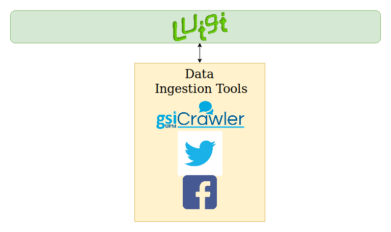
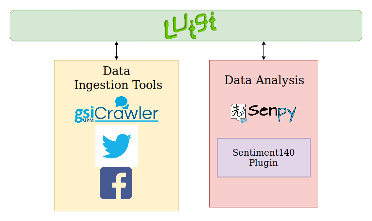
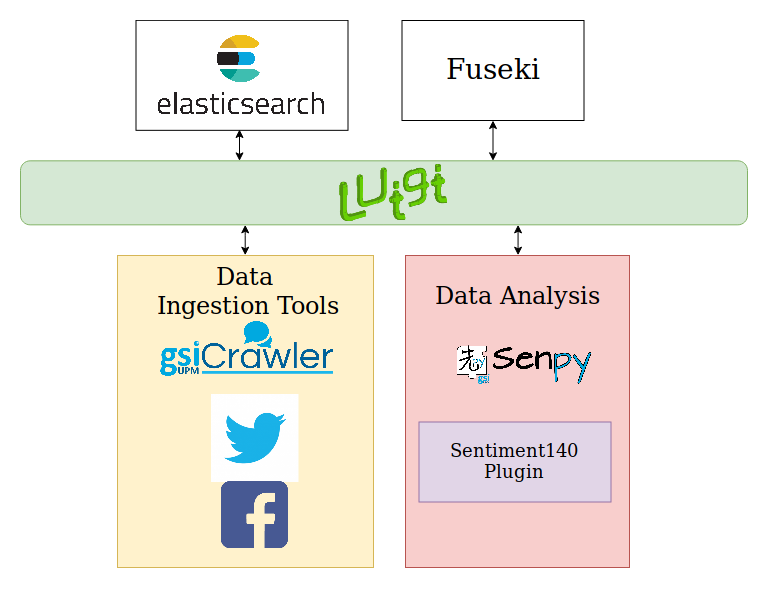

=============
Configuration
=============

This configuration for the orchestraror is based on the SOMEDI project. In this use example we are going to track Restaurantes Lateral brand on social media.

We are going to describe this example in different incremental phases.

I. Use GSICrawler to get tweets and Facebook posts from official accounts
~~~~~~~~~~~~~~~~~~~~~~~~~~~~~~~~~~~~~~~~~~~~~~~~~~~~~~~~~~~~~~~~~~~~~~~~~

This phase gets tweets and Facebook posts from official accounts and shows results printed.

Below is the detailed part of the task located on `somedi-usecase/workflow.py`.

.. sourcecode:: python 

    class ScrapyTask(GSICrawlerScraper):
        query = luigi.Parameter()
        id = luigi.Parameter()
        number = luigi.Parameter()
        source = luigi.Parameter()
        host = 'http://gsicrawler:5000/api/v1'

        def output(self):
            return luigi.LocalTarget(path='/tmp/_scrapy-%s.json' % self.id)

As shown in the code we select as endpoint our GSICrawler demo service and other parameters are going to be given by command line.

Run the orchestrator's workflow to retrieve the 10 latests tweets:

.. sourcecode:: bash 

    $ docker-compose exec orchestrator python -m luigi --module somedi-usecase.workflow ScrapyTask --query rest_lateral --number 10 --source twitter --id 1

Now run the orchestrator's workflow to retrieve the 10 latests facebook posts, the query must be the official account name on Facebook without @:

.. sourcecode:: bash 

    $ docker-compose exec orchestrator python -m luigi --module somedi-usecase.workflow ScrapyTask --query restauranteslateral --number 10 --source facebook --id 2

Below you can see the services involved in this phase:

II. Analyse collected tweets and Facebook posts with Senpy
~~~~~~~~~~~~~~~~~~~~~~~~~~~~~~~~~~~~~~~~~~~~~~~~~~~~~~~~~~

This phase improve the previous one adding analysis with Senpy.

Below is the detailed part of the task located on `somedi-usecase/workflow.py`.

.. sourcecode:: python 

    class AnalysisTask(SenpyAnalysis):

       query = luigi.Parameter()
       id = luigi.Parameter()
       number =luigi.Parameter()
       source = luigi.Parameter()
       host = 'http://senpy:5000/api/'
       algorithm = luigi.Parameter()
       lang = luigi.Parameter()
     
       def requires(self):
           return ScrapyTask(self.id,self.query,self.number,self.source)
     
       def output(self):
           return luigi.LocalTarget(path='/tmp/analysed%s.json'%self.id)

As shown in the code we select as endpoint our Senpy service and other parameters are going to be given by command line.

You must select what Senpy's algorithm and language are going to be used in the analysis.

Run again the orchestrator's workflow using sentiment140 plugin in spanish:

.. sourcecode:: bash 

    $ docker-compose exec orchestrator python -m luigi --module somedi-usecase.workflow AnalysisTask --query restauranteslateral --number 10 --source facebook --algorithm sentiment140 --lang es --id 3

.. sourcecode:: bash 

    $ docker-compose exec orchestrator python -m luigi --module somedi-usecase.workflow AnalysisTask --query rest_lateral --number 10 --source twitter --algorithm sentiment140 --lang es --id 4

Below you can see the services involved in this phase:

III. Store collected and analysed tweets on Fuseki and Elasticsearch
~~~~~~~~~~~~~~~~~~~~~~~~~~~~~~~~~~~~~~~~~~~~~~~~~~~~~~~~~~~~~~~~~~~~

This phase improve the previous one adding a persistence layer to store results. 

Below is the detailed part of the task located on `somedi-usecase/workflow.py`.

.. sourcecode:: python 

    class FusekiTask(CopyToFuseki):
        
        id = luigi.Parameter()
        query = luigi.Parameter()
        number = luigi.Parameter()
        source = luigi.Parameter()
        algorithm = luigi.Parameter()
        lang = luigi.Parameter()
        host = 'fuseki'
        port = 3030

        def requires(self):
            return AnalysisTask(self.id,self.query,self.number,self.source)
            
        def output(self):
            return luigi.LocalTarget(path='/tmp/_n3-%s.json' % self.id)

    class ElasticsearchTask(CopyToIndex):
        
        id = luigi.Parameter()
        query = luigi.Parameter()
        number = luigi.Parameter()
        source = luigi.Parameter()
        algorithm = luigi.Parameter()
        lang = luigi.Parameter()
        index = 'somedi'
        doc_type = 'lateral'
        host = 'elasticsearch'
        port = 9200
        timeout = 100

        def requires(self):
            return AnalysisTask(self.id,self.query,self.number,self.source)

    class StoreTask(luigi.Task):

        id = luigi.Parameter()
        query = luigi.Parameter()
        number = luigi.Parameter()
        source = luigi.Parameter()
        algorithm = luigi.Parameter()
        lang = luigi.Parameter()

        def requires(self):
            yield FusekiTask(self.id, self.query, self.number)
            yield Elasticsearch(self.id, self.query, self.number)

Run again the orchestrator's workflow:

.. sourcecode:: bash 
    
    $ docker-compose exec orchestrator python -m luigi --module somedi-usecase.workflow StoreTask --query restauranteslateral --number 10 --source facebook --algorithm sentiment140 --lang es --id 5

    $ docker-compose exec orchestrator python -m luigi --module somedi-usecase.workflow StoreTask --query rest_lateral --number 10 --source twitter --algorithm sentiment140 --lang es --id 6

Below you can see the services involved in this phase:

Now your data is available on elasticsearch and fuseki.

IV. Show stored data in a Sefarad dashboard
~~~~~~~~~~~~~~~~~~~~~~~~~~~~~~~~~~~~~~~~~~~

Open a web browser and navigate to Sefarad environment on http://localhost:8080. This intectactive dashboard shows tweets and Facebook posts collected and analysed on the previous phase. We can distinguish between posts created by the official account and replies.

V. Use GSICrawler to track direct competitors
~~~~~~~~~~~~~~~~~~~~~~~~~~~~~~~~~~~~~~~~~~~~~

This phase track other food restaurants chains. In this example we will track 100 Montaditos. We modify our orchestrator's workflow parameters and run it again:

.. sourcecode:: bash 
    
    $ docker-compose exec orchestrator python -m luigi --module somedi-usecase.workflow StoreTask --query 100MontaditosSpain --number 10 --source facebook --algorithm sentiment140 --lang es --id 7

    $ docker-compose exec orchestrator python -m luigi --module somedi-usecase.workflow StoreTask --query 100montaditos --number 10 --source twitter --algorithm sentiment140 --lang es --id 8

Sefarad dashboard now is updated with new analysed data talking about 100 Montaditos.