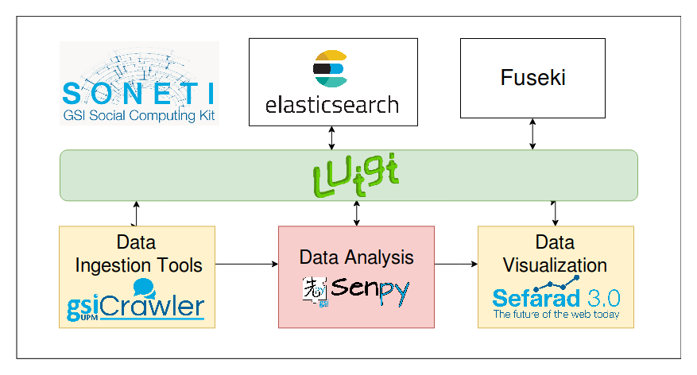

.. soneti documentation master file, created by
   sphinx-quickstart on Wed Jul 12 11:08:03 2017.
   You can adapt this file completely to your liking, but it should at least
   contain the root `toctree` directive.

Welcome to Soneti's documentation!
==================================

**Soneti** is a toolkit for **analyzing social media**, such as social networks (e.g. Twitter, Facebook, ...), blogs, YouTube, Newspapers, AppStores, etc..

Soneti provide services to obtain data from different web services, perfom different of analysis in order to enrich extracted data and visualize this analysis results in interactive dashboards.

.. toctree::
   :maxdepth: 2
   :caption: Contents:

   what-is-soneti
   installation
   usecases
   conventions
..   uses-soneti
   

Indices and tables
==================

* :ref:`genindex`
* :ref:`modindex`
* :ref:`search`
