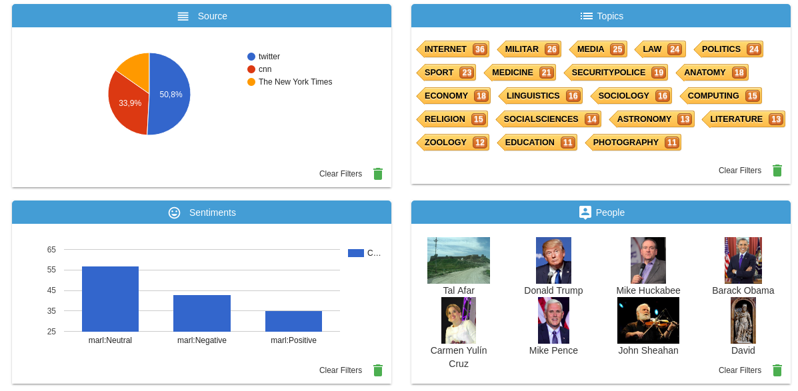

=========
Use cases
=========

In this documentation we are going to show some uses of Soneti toolkit.

SOMEDI: Social Media and Digital Interaction Intelligence
---------------------------------------------------------

This project uses Soneti toolkit to analyse social media data about different brands. 

SOMEDI tries to solve the challenge of efficiently generating and utilising social media and digital interaction data enabled intelligence.

GSICrawler service in this project is getting data talking about a certain brand from social networks, such as Twitter and Facebook. Secondly, we enrich this data using Senpy. We use an entity detector to know what is being talked about in order to later know if the opinion generated about that entity is positive or negative. Last step is to visualize results in a Sefarad dashboard that resumes opinion and trends.

This project provides the opportunity to extract and use this information to better serve and engage users and audiences.

TRIVALENT: Terrorism pReventIon Via rAdicaLisation countEr-NarraTive
--------------------------------------------------------------------

This project uses Soneti toolkit to detect potential radicalism messages among social media. 

GSICrawler service is in charge of extracting information from several web sources under the news of social media categories. Currently, the available newspapers are CNN News, The New York Times and AlJazeera. Additionally, it is also possible to extract information from PDF sources such as Dabiq Magazine, which has been the official Daesh propaganda magazine for years.

Furthermore, Senpy plugins provide added value services for data analysis tasks, easing their implementation thanks to Senpy architecture. Each plugin has an entry and a semantically annotated output useful for linked data processes. TRIVALENT project uses two Senpy plugins:

* **Translator plugin + COGITO plugin**: This analysis takes as input GSICrawler written in a source language (e.g. Arabic), translates it into a target language (e.g English) and extracts information such as people, places and organizations mentioned on it following linked data annotation principles.

