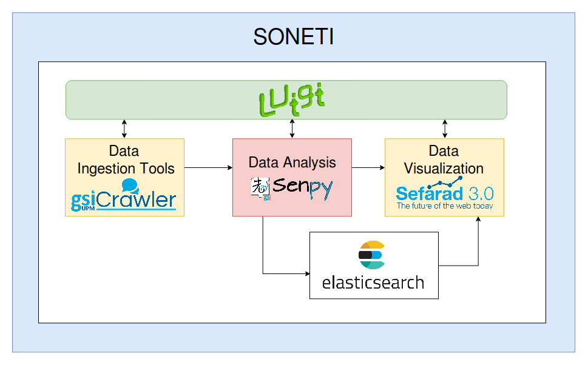

.. soneti documentation master file, created by
   sphinx-quickstart on Wed Jul 12 11:08:03 2017.
   You can adapt this file completely to your liking, but it should at least
   contain the root `toctree` directive.

Welcome to Soneti's documentation!
==================================

**Soneti** is a toolkit for **analyzing social media**, such as social networks (e.g. Twitter, Facebook, ...), blogs, YouTube, Newspapers, AppStores, etc.. 

It obtains data from different sources, in addition it enriches this obtained data by performing different types of automatic analysis. Finally, it allows us to visualize the data obtained in interactive dashboards.

.. toctree::
   :maxdepth: 2
   :caption: Contents:

   what-is-soneti
   installation
   usecases
   conventions
..   uses-soneti
   

Indices and tables
==================

* :ref:`genindex`
* :ref:`modindex`
* :ref:`search`
